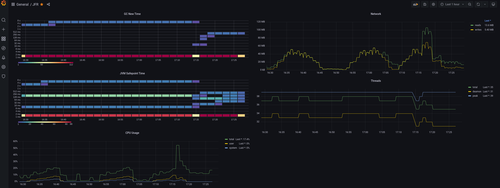
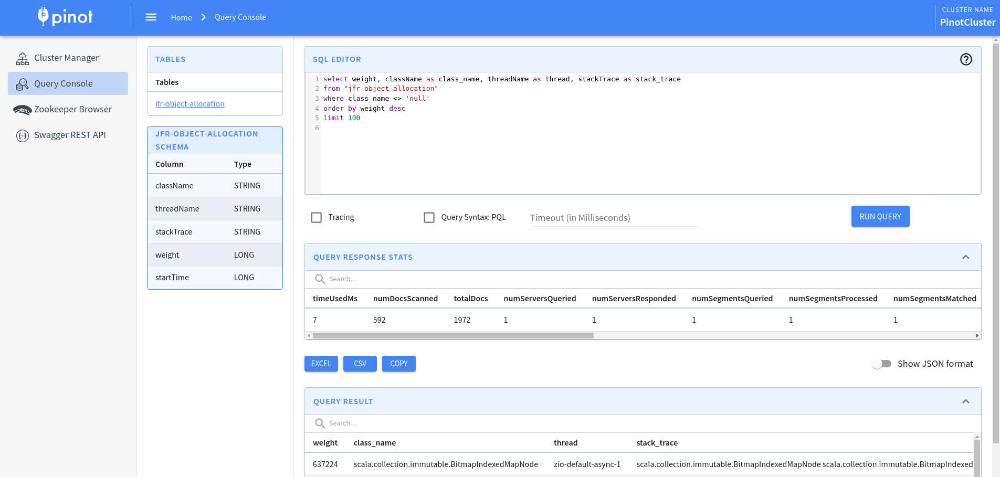
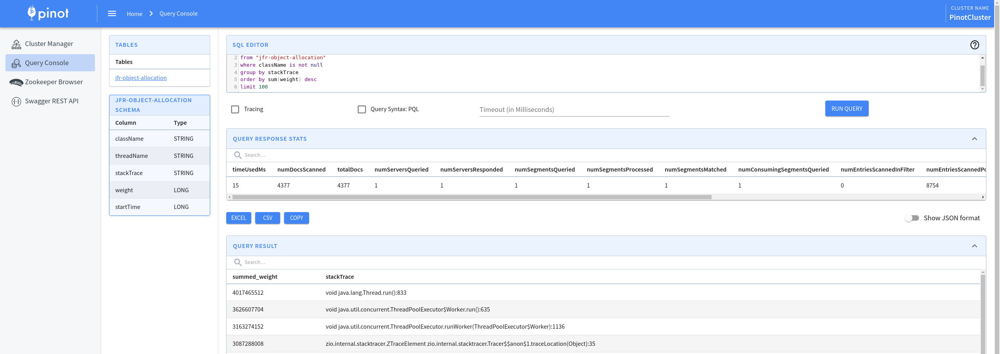
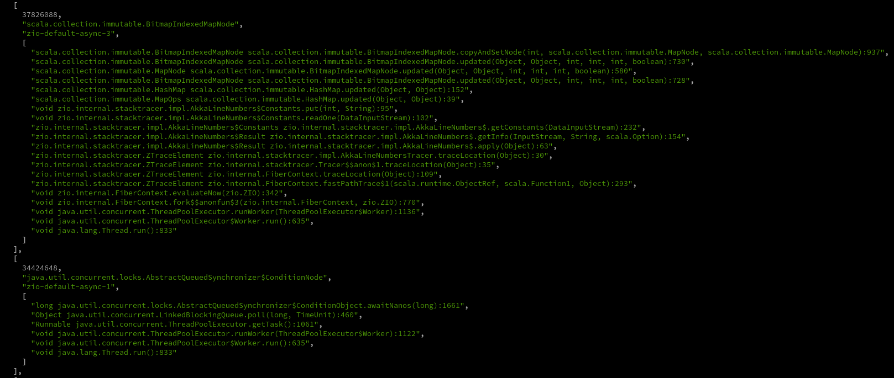

# JFR playground

A proof of concept of how to collect metrics using the JDK Flight Recorder 
event streaming([JEP 349]) and [Kamon] telemetry to send them to `Prometheus/Pinot`

## Prerequisites
* Java 17+
* [sbt]
* [k6]

# Kamon + Prometheus + Grafana

```shell
# Prometheus + Grafana + Metrics dashboard
docker-compose -f docker/grafana-prometheus-compose.yml up

# Example service
sbt run

# Stress the service
k6 run k6/stress.js      

          /\      |‾‾| /‾‾/   /‾‾/   
     /\  /  \     |  |/  /   /  /    
    /  \/    \    |     (   /   ‾‾\  
   /          \   |  |\  \ |  (‾)  | 
  / __________ \  |__| \__\ \_____/ .io

  execution: local
     script: k6/stress.js
     output: ...........
```
Then open the "JFR Metrics" dashboard in Grafana(localhost:3000) and Enjoy!


    
# Bonus
Send profiling information(`jdk.ObjectAllocationSample`) to [Pinot] realtime table via Kafka and play with it ;)

```shell
# Kafka + Pinot
docker-compose -f pinot-kafka-compose.yml up

# Topic
docker exec -t kamon-jrf-playground_kafka  kafka-topics --create --bootstrap-server localhost:9092 --replication-factor 1 --partitions 1 --topic jfr-allocation-topic

# Table Schema
curl -X POST "http://localhost:9000/schemas?override=true" -H "accept: application/json" -H "Content-Type: application/json" -d @jfr-allocation-schema.json

# Realtime Table configuration
curl -X POST "http://localhost:9000/tables" -H "accept: application/json" -H "Content-Type: application/json" -d @jfr-object-allocation-table.json

# Enable `jdk.ObjectAllocationSample` event in application.conf changing
"jdk.ObjectAllocationSample#enabled=false" to "jdk.ObjectAllocationSample#enabled=true" 
```
Then open the [Pinot] `SQL Console(localhost:9000/#/query)` and Enjoy!






Also, we can use a `curl` with a little of `jq` 

```shell
curl 'http://localhost:9000/sql' \ 
--data-raw $'{
  "sql":"select weight, className as class_name, threadName as thread, stackTrace as stack_trace 
         from 'jfr-object-allocation' 
         where class_name <> 'null' 
         order by weight 
         desc limit 100", 
   "trace":false
}' | jq '.[] | {rows}'
```


## Disclaimer
I have just scratched the surface of [Pinot] capabilities, and I'm sure there are other better ways of modeling than the one proposed, 
using other features and data types.

# License

This code base is available ander the Apache License, version 2.

[Kamon]: https://github.com/kamon-io/Kamon#kamon
[JEP 349]: https://openjdk.java.net/jeps/349
[sbt]: https://www.scala-sbt.org/
[k6]: https://github.com/grafana/k6
[Pinot]: https://pinot.apache.org/
